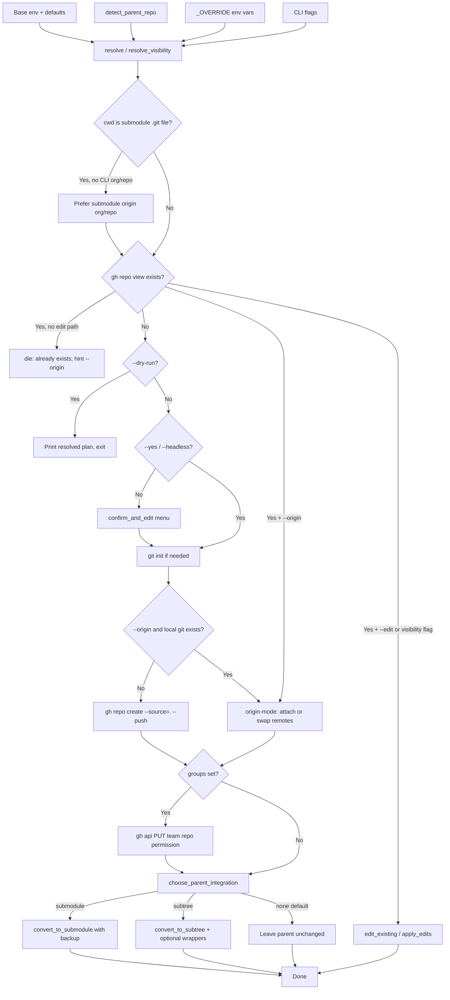
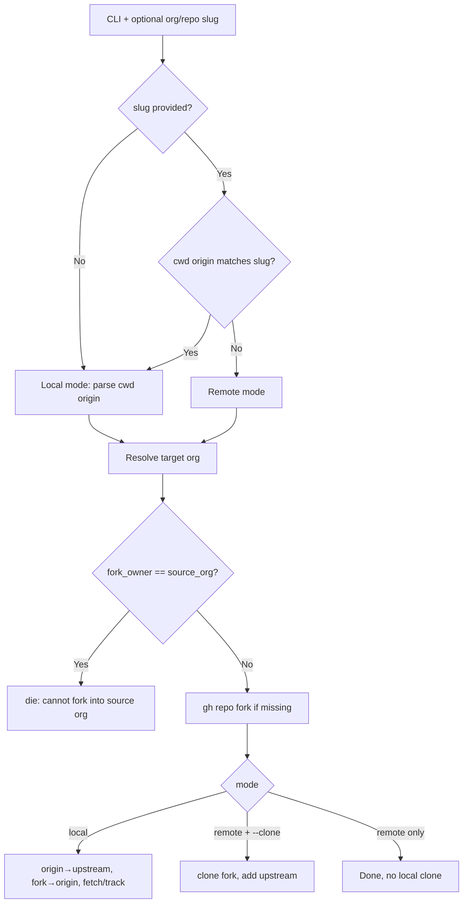

# Project Architecture

## Overview

`make-repo` is a two-tool Bash CLI package wrapping GitHub CLI (`gh`) and `git`:

| Tool | Path | Role |
|------|------|------|
| `make-repo` | `bin/make-repo` (~999 lines) | Create or edit a GitHub repo from the cwd; optional parent-repo inheritance and post-create subtree/submodule integration |
| `fork-repo` | `bin/fork-repo` (~436 lines) | Fork a repo and rewire remotes (`origin` / `upstream`), preserving ssh vs https |

Both scripts are self-contained (`set -euo pipefail`). They do **not** source monorepo `share/k8-lib` or any package `lib/` — only `bash`, `git`, and authenticated `gh` at runtime. Install via `make install` → `~/.local/bin` (or monorepo `make install-utilities`).

## make-repo Flow

### Value precedence (highest wins)

1. CLI flags (`--org`, `--public`, …)
2. `GH_NEW_REPO_*_OVERRIDE` env vars
3. Parent repo org/visibility (from nearest containing GitHub remote), unless `--no-inherit`
4. Base `GH_NEW_REPO_*` env vars
5. Built-ins: org `noizu`, visibility `private`, repo name = cwd basename

`--no-inherit` clears inherited org/visibility only. Filesystem parent root (`parent_git_root` / `subdir_relpath`) is still retained so post-create integration remains available.

### Parent detection

`detect_parent_repo` handles three cwd shapes:

- **Submodule** (`.git` is a file): walk from `gitdir:` toward a parent worktree with `.git/`
- **Nested path in a normal repo**: `git rev-parse --show-toplevel` when toplevel ≠ `$PWD`
- **Not yet a git repo**: walk parents until a containing `.git` is found

Parent org is parsed from `origin` (ssh or https). Visibility is read via `gh repo view … --json visibility`.

If cwd is already a submodule and org/repo were not set on the CLI, the script then prefers the **submodule’s own** `origin` slug over parent-inferred identity (edit/create against the child remote).

### Create path

1. Preflight: `gh` present and `gh auth status` ok.
2. Unless `--dry-run` / auto-confirm: interactive numbered menu (org, repo, visibility, description, groups).
3. Init local git if missing; if cwd is a submodule file-git, detach (remove `.git` file, re-init standalone) before create.
4. `gh repo create "$org/$repo" --source=. --push --{public|private} --description …`
5. Optional team grants: `PUT /orgs/{org}/teams/{team}/repos/{full_name}` with roles `pull|push|admin|maintain|triage` (per-entry `:role` or `--group-role`, default `push`).
6. Parent integration (below).

### Edit path

`--edit`, or an existing remote when `--public`/`--private` is set, loads current visibility/description from GitHub and applies only changed fields (`gh repo edit`, same team API). Visibility change gets an extra confirm unless `--yes`/`--headless`.

### Parent integration

After a successful create, if a parent worktree was found:

| Mode | Trigger | Behavior |
|------|---------|----------|
| **none** | default; `--no-integration` / legacy `--no-submodule`; `--yes` alone | Parent left unchanged |
| **subtree** | interactive choice 2 or `--subtree` | Move nested `.git` aside, stage path in parent, commit with `git-subtree-dir` / `git-subtree-split` trailers; restore nested git on failure; print portable `git subtree pull|push` commands; optionally register wrappers |
| **submodule** | interactive choice 3 or `--submodule` | Backup to `copy.<basename>`, `git submodule add`, content verify vs backup, commit gitlink; restore backup if add fails |

**Wrapper registration** (`register_subtree_wrappers`): only if **both** `push-subtrees.sh` and `pull-subtrees.sh` exist at the parent root, the path is not already registered, and `push-subtrees.sh` is clean. Adds a collision-safe parent remote alias and an idempotent `"prefix|remote|branch"` line into `SUBTREES=(…)` in `push-subtrees.sh` (committed separately). Pull wrapper discovers via `push-subtrees.sh --list`. Otherwise only the printed direct commands are used — no files invented.

Conflicting integration flags die early (`set_integration_mode`).

## fork-repo Flow

Target org: `--org` > `GH_FORK_TARGET_ORG_OVERRIDE` > `GH_FORK_TARGET_ORG` > authenticated user (`gh api /user`). Local mode preserves remote URL scheme (ssh/https). Existing `upstream` conflicts prompt (or overwrite under `--yes`). `--clone` only applies in remote slug mode. No `--headless` flag (use `--yes`).

## Core Components

| Component | Where | Purpose |
|-----------|--------|---------|
| CLI parser | both | `case/esac`; `--help` from header comment (`make-repo`) or first ~25 lines (`fork-repo`) |
| `detect_parent_repo` | make-repo | Parent worktree + org/visibility; keeps paths even when inheritance disabled |
| `resolve` / `resolve_visibility` | both / make-repo | Layered defaults; visibility override is `1`/`0` |
| Submodule identity pass | make-repo | Prefer child origin org/repo when already a submodule |
| `confirm_and_edit` / `edit_existing` | make-repo | Numbered interactive menus |
| Create / team grant | make-repo | `gh repo create` + REST team permissions |
| `choose_parent_integration` | make-repo | ask / none / subtree / submodule; safe default under auto-confirm |
| `convert_to_subtree` / `register_subtree_wrappers` | make-repo | Subtree metadata commit + optional monorepo wrapper registry |
| `convert_to_submodule` | make-repo | Backup, add, verify, commit |
| `apply_edits` | make-repo | Patch visibility/description/teams on existing repos |
| Mode + remote rewirer | fork-repo | Local vs remote; rename/set origin & upstream |
| Install | `Makefile` | Copy both bins to `~/.local/bin` (755; skip if `realpath` same file); `compile` no-op |
| Integration suite | `tests/run.sh` | Temp parent/child trees + fake `gh`; no network |

## Testing

`make test` → `tests/run.sh`. Coverage (as of suite):

- Default interactive integration choice → none; child `.git` kept
- `--yes --subtree` trailers + printed commands; no wrappers if scripts absent
- Wrapper path when monorepo root `push-subtrees.sh` / `pull-subtrees.sh` are copied into the temp parent
- `--yes --submodule` → `.gitmodules` + gitlink
- `--no-inherit` still allows subtree conversion
- `--yes --dry-run` / `--headless` report safe parent default without create
- Conflicting `--subtree --submodule` fails
- `--origin` add/swap/decline/collision/attach; submodule `.gitmodules` + preserved gitdir; worktree shared remotes; dry-run noop; existing GitHub without `--origin` still dies

**Note:** the wrapper-registration case reaches outside the package to copy scripts from the monorepo root (`../../..` from package root). Outside this monorepo checkout that case may fail even though production code only *reads* wrappers if present.

Static checks (dev-only): `shellcheck bin/make-repo tests/run.sh`; `bash -n …`.

## Key Design Decisions

- **Portable single files** — no k8-lib; usable outside Noizu infra
- **Parent inheritance vs parent mutation are separate** — org/visibility inherit by default; filesystem parent is never mutated unless user chooses or passes `--subtree`/`--submodule`
- **Safe automation default** — `--yes` / `--headless` / `--non-interactive` skip prompts and select **no** parent integration unless an integration flag is explicit
- **Subtree-first monorepo convention** — printed direct `git subtree` commands always; wrapper registry is opportunistic, never required
- **Fail-safe conversions** — subtree restores nested `.git` on stage/commit failure; submodule restores from `copy.<name>` if `submodule add` fails
- **`_OVERRIDE` env tier** — direnv/`.envrc` can beat parent detection without CLI flags
- **`generate_description()` stub** — currently returns `"No additional details."`; reserved for future AI CLI integration
- **Auto edit on existing + visibility flag** — avoids a hard error when operators only meant to flip public/private
- **`--origin` is remote surgery, not a second tool** — same org/repo picker; never detaches submodules; never force-pushes; `--yes` cannot swap without `--swap-origin`
- **Do not patch worktree `.git` files** — they only store `gitdir:`. Remotes live in `$GIT_COMMON_DIR/config`. Extra work is `.gitmodules` + `git submodule sync` and rare per-worktree `remote.origin.url` overrides

### Origin mode

`--origin` / `-origin` classifies cwd as `none` | `nested` | `repo` | `worktree` | `submodule`, then:

| Action | When |
|--------|------|
| Usual create (`--source=. --push`) | Nested/empty checkout with no remotes |
| `remote add origin` | Existing git, no origin |
| no-op | Origin already matches picked `org/repo` (scheme preserved) |
| swap | Origin differs: rename to `{owner}-origin` (collision → `-2`, …) then add new origin |

Submodule: edit current superproject `.gitmodules`, `git submodule sync -- <path>` here and in other parent worktrees that have the path checked out. Superproject is **not** auto-committed. Parent subtree/submodule conversion is skipped unless `--subtree`/`--submodule` is explicit.

## Technology

| Tool | Role |
|------|------|
| Bash | Runtime (`set -euo pipefail`) |
| `gh` CLI | Auth, repo create/view/edit/fork, team API, user login |
| `git` | Init, remotes, parent discovery, subtree/submodule conversion |
| GNU make | `install` / `test` / `compile` (no-op) |

## Related docs

- Layout: [`PROJ-LAYOUT.md`](PROJ-LAYOUT.md)
- Tasks: [`PROJ-HOWTO.md`](PROJ-HOWTO.md), [`howto/avoid-submodule-conversion.md`](howto/avoid-submodule-conversion.md)
- FAQ: [`PROJ-FAQ.md`](PROJ-FAQ.md)
- User-facing flags/env: [`../README.md`](../README.md)
