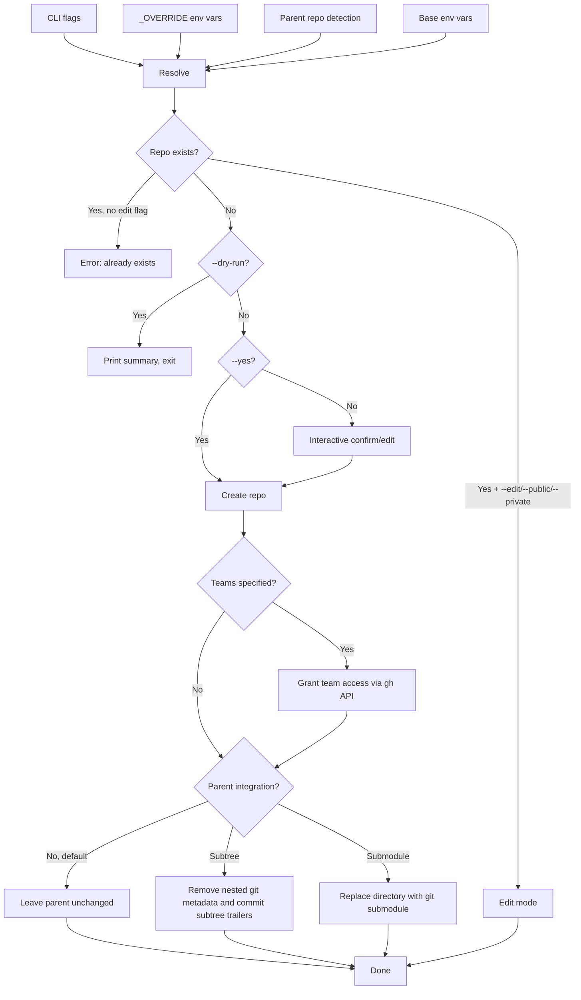

# Project Architecture

## Overview

`make-repo` is a two-tool Bash CLI package wrapping the GitHub CLI (`gh`) for repository lifecycle operations: `bin/make-repo` creates or edits GitHub repos with sensible defaults, interactive confirmation, and automatic context inheritance from parent repos; `bin/fork-repo` forks repos and rewires local remotes (origin/upstream).

Both tools are single-file scripts with no dependencies beyond `gh` and `git` — notably, they do **not** source the shared `share/k8-lib` used by other Noizu utilities, keeping them portable outside the monorepo.

## make-repo Flow

## fork-repo Flow

Two operating modes, selected by presence of a positional `org/repo` slug:

- **Local clone mode** (no arg): forks the current directory's repo, renames `origin` → `upstream`, sets the fork as new `origin` (preserving ssh/https scheme).
- **Remote slug mode** (`fork-repo org/repo`): forks the specified repo into the target org; with `--clone`, clones the fork and adds the source as `upstream`.

Target org resolves: CLI `--org` > `GH_FORK_TARGET_ORG_OVERRIDE` > `GH_FORK_TARGET_ORG` > authenticated user. Guards against forking a repo into its own source org.

## Core Components

| Component | Script | Purpose |
|-----------|--------|---------|
| CLI parser | both | Flag parsing with `case/esac` loop; `--help` renders the header comment |
| Parent detector | make-repo | Walks git tree upward to inherit org/visibility from containing repo or submodule parent |
| Value resolver | both | Precedence: CLI > `_OVERRIDE` env > parent repo (make-repo only) > base env > defaults |
| Interactive prompt | both | Numbered-field menu for reviewing/editing settings before acting (`--yes` skips) |
| Repo creator | make-repo | `gh repo create` with `--source=. --push` |
| Team granter | make-repo | `gh api PUT` to `/orgs/{org}/teams/{team}/repos/{repo}` |
| Parent integrator | make-repo | Post-create choice: none (default), subtree metadata commit, or backed-up submodule conversion; prints direct subtree commands and optionally updates root wrapper registry |
| Edit mode | make-repo | Fetches current settings from GitHub, applies only changed fields |
| Remote rewirer | fork-repo | Renames origin→upstream, points origin at the fork, matching original ssh/https scheme |

## Installation

`Makefile` `install` target copies both scripts to `~/.local/bin` (mode 755), skipping when `realpath` shows source and destination are already the same file (symlink-aware). `test` runs isolated fake-`gh` integration coverage for the none/subtree/submodule paths; `compile` is a no-op. The target trio matches the monorepo's `make install-utilities` convention.

## Key Design Decisions

- **Single-file, no dependencies beyond `gh`/`git`** — portability; no k8-lib sourcing, works outside the Noizu monorepo
- **Parent repo inheritance** (make-repo) — submodule and subdirectory contexts auto-inherit org and visibility, reducing flags needed in monorepo/subtree workflows
- **Interactive by default, scriptable with `--yes` or `--headless`** — safety for humans, automation for CI; both `--yes`/`-y` and `--headless` (alias `--non-interactive`) enable non-interactive mode and skip all prompts, with `--headless` as the explicit, semantically-named CI/scripting switch; `--dry-run` for previews
- **No implicit parent mutation** — post-create integration defaults to none; `--subtree` and `--submodule` make automation explicit
- **Wrapper-aware subtree registration** — if both root pull/push wrappers exist, add a collision-safe parent remote and idempotent entry to their shared registry; otherwise only print portable direct commands
- **`_OVERRIDE` env tier** — lets `.envrc` files pin values that beat parent detection without requiring CLI flags
- **`generate_description()` stub** — placeholder for future AI-generated repo descriptions (e.g. via `claude` or `gh copilot`)

## Technology

| Tool | Role |
|------|------|
| Bash | Script runtime (`set -euo pipefail`) |
| `gh` CLI | GitHub API (repo CRUD, forks, team access, auth) |
| `git` | Local repo init, remote detection/rewiring |
| GNU make | Install to `~/.local/bin` |
